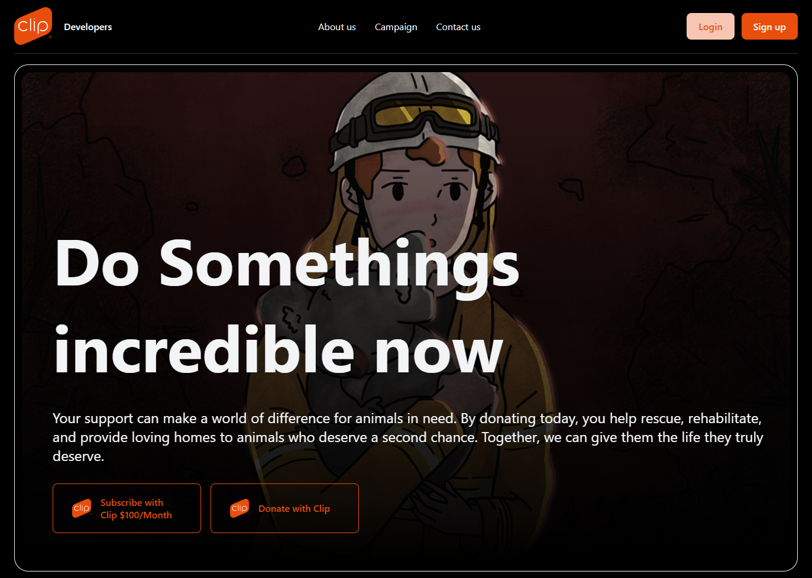

# 🎬 Clip Demo

Una aplicación web frontend construida con [Lit](https://lit.dev/) y empacada con [Vite](https://vitejs.dev/). Este proyecto es una demo visual que utiliza componentes web personalizados para mostrar contenido multimedia de manera elegante y moderna.

## 🚀 Demo

Puedes ver una captura de la interfaz a continuación:

---

## 🧱 Tecnologías Utilizadas

- **[Lit 3.1.4](https://lit.dev/)** – Librería para crear componentes web rápidos y reutilizables.
- **[Vite 5.4](https://vitejs.dev/)** – Bundler ultrarrápido para proyectos frontend modernos.
- **HTML5** – Lenguaje de marcado.
- **CSS** – Estilos personalizados.

---

## 📁 Estructura del Proyecto

\`\`\`plaintext
clip-projects-main/
├── public/
│   └── vite.svg              # Icono de Vite
├── src/
│   ├── assets/
│   │   ├── banner.png        # Imagen del banner principal
│   │   └── lit.png           # Logo de Lit
│   ├── components/
│   │   ├── banner-component.js   # Componente del banner
│   │   └── nav-component.js      # Componente de navegación
│   └── index.css             # Estilos base
├── index.html                # Página principal
├── package.json              # Configuración de dependencias
├── vite.config.js            # (opcional, si se incluye configuración extra)
└── README.md                 # Este archivo
\`\`\`

---

## 🛠️ Instalación y Ejecución

1. **Clona el repositorio**:

   \`\`\`bash
   git clone https://github.com/tuusuario/clip-demo.git
   cd clip-demo
   \`\`\`

2. **Instala las dependencias**:

   \`\`\`bash
   npm install
   \`\`\`

3. **Inicia el servidor de desarrollo**:

   \`\`\`bash
   npm run dev
   \`\`\`

4. **Abre tu navegador** y visita: \`http://localhost:5173\`

---

## 👥 Contribuciones

¡Las contribuciones son bienvenidas! Para contribuir:

1. Haz un fork del repositorio
2. Crea una nueva rama: \`git checkout -b feature/nueva-funcionalidad\`
3. Realiza tus cambios y haz commit: \`git commit -m "Agrega nueva funcionalidad"\`
4. Envía un Pull Request

---

## ✍️ Autor

- **Tu Nombre** – [@tuusuario](https://github.com/tuusuario)

---

## ✅ To-Do

- [ ] Agregar más componentes reutilizables
- [ ] Añadir responsividad para móviles
- [ ] Implementar modo oscuro
- [ ] Optimizar carga de imágenes
- [ ] Escribir pruebas unitarias para los componentes

---

## 📄 Licencia

Este proyecto está bajo la licencia [MIT](LICENSE).